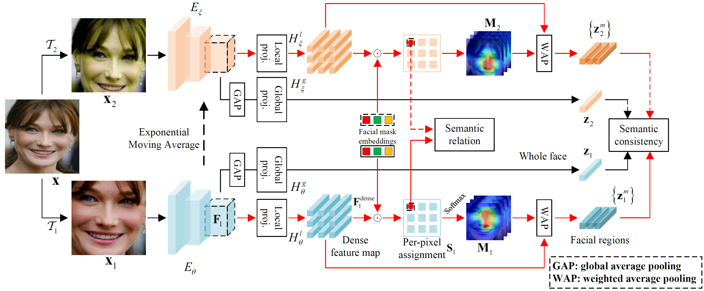

# Self-Supervised Facial Representation Learning with Facial Region Awareness

<p align="center">
    <a href="https://arxiv.org/abs/2403.02138"></a>
</p>
<p align="center">
	Self-Supervised Facial Representation Learning with Facial Region Awareness (CVPR 2024)<br>
  By
  <a href="">Zheng Gao</a> and 
  <a href="">Ioannis Patras</a>.
</p>

## Introduction

> **Abstract**: Self-supervised pre-training has been proved to be effective in learning transferable representations that benefit various visual tasks. This paper asks this question: can self-supervised pre-training learn general facial representations for various facial analysis tasks? Recent efforts toward this goal are limited to treating each face image as a whole, i.e., learning consistent facial representations at the image-level, which overlooks the **consistency of local facial representations** (i.e., facial regions like eyes, nose, etc). In this work, we make a **first attempt** to propose a novel self-supervised facial representation learning framework to learn consistent global and local facial representations, Facial Region Awareness (FRA). Specifically, we explicitly enforce the consistency of facial regions by matching the local facial representations across views, which are extracted with learned heatmaps highlighting the facial regions. Inspired by the mask prediction in supervised semantic segmentation, we obtain the heatmaps via cosine similarity between the per-pixel projection of feature maps and facial mask embeddings computed from learnable positional embeddings, which leverage the attention mechanism to globally look up the facial image for facial regions. To learn such heatmaps, we formulate the learning of facial mask embeddings as a deep clustering problem by assigning the pixel features from the feature maps to them. The transfer learning results on facial classification and regression tasks show that our FRA outperforms previous pre-trained models and more importantly, using ResNet as the unified backbone for various tasks, our FRA achieves comparable or even better performance compared with SOTA methods in facial analysis tasks.




## Installation
Please refer to `requirement.txt` for the dependencies. Alternatively, you can install dependencies using the following command:
```
pip3 install -r requirement.txt
```
The repository works with `PyTorch 1.10.2` or higher and `CUDA 11.1`.

## Get started

We provide basic usage of the implementation in the following sections:

### Pre-training on VGGFace2

Download [VGGFace2](https://academictorrents.com/details/535113b8395832f09121bc53ac85d7bc8ef6fa5b) dataset and specify the path to VGGFace2 by `DATA_ROOT="./data/VGG-Face2-crop"`.

To perform pre-training of the model with ResNet-50 backbone on VGGFace2 with multi-gpu, run:
```
python3 launch.py --device=${DEVICES} --launch main.py \
    --arch FRAB --backbone resnet50_encoder \
    --dataset vggface2 --data-root ${DATA_ROOT} \
    --lr 0.9 -b 512 --wd 0.000001 --epochs 50 --cos --warmup-epoch 10 --workers 16 \
    --enc-m 0.996 \
    --norm SyncBN \
    --lewel-loss-weight 0.5 \
    --mask_type="attn" --num_proto 8 --teacher_temp 0.04 --loss_w_cluster 0.1 \
    --amp \
    --save-dir ./ckpts --save-freq 50 --print-freq 100
```
`DEVICES` denotes the gpu indices.

### Evaluation: Facial expression recognition (FER)
The following is an example of evaluating the pre-trained model on RAFDB dataset, under the setting of fine-tuning both encoder backbone and linear classifier:
```
python3 launch.py --device=${DEVICES} --launch main_fer.py \
    -a resnet50 \
    --dataset rafdb --data-root ${FER_DATA_ROOT} \
    --lr 0.0002 --lr_head 0.0002 --optimizer adamw --weight-decay 0.05 --scheduler cos \
    --finetune \
    --epochs 100 --batch-size 256 \
    --amp \
    --workers 16 \
    --eval-freq 5 \
    --model-prefix online_net.backbone \
    --pretrained ${PRETRAINED} \
    --image_size 224 \
    --multiprocessing_distributed
```
`PRETRAINED` denotes the path to the pre-trained checkpoint and `FER_DATA_ROOT=/path/to/datasets` is the location for FER datasets.

### Evaluation: Face alignment
For evaluation on face alignment, we use [STAR Loss](https://github.com/ZhenglinZhou/STAR) as the downstream backbone. Please refer to [STAR Loss](https://github.com/ZhenglinZhou/STAR).


## Citation

If you find this repository useful, please consider giving a star :star: and citation:

```bibteX
@article{gao2023self,
  title={Self-Supervised Representation Learning with Cross-Context Learning between Global and Hypercolumn Features},
  author={Gao, Zheng and Patras, Ioannis},
  journal={arXiv preprint arXiv:2308.13392},
  year={2023}
}
```

## Acknowledgment
Our project is based on [LEWEL](https://github.com/LayneH/LEWEL). Thanks for their wonderful work.


## License

This project is released under the [CC-BY-NC 4.0 license](LICENSE).